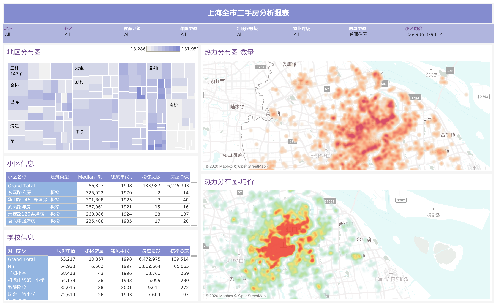

# HousePriceAnalysis

上海地区新房和二手房数据的爬虫抓取, 数据处理和可视化分析

1. 从房天下通过爬虫获取二手房数据
2. 对数据进行清洗和优化，通过高德API获取经纬度， 并计算到特定点的直线距离
3. 基于 Tableau 进行数据可视化分析 [Tableau 可视化分析](https://public.tableau.com/views/ShangHai_HousePrice/sheet5?:language=en&:display_count=y&:origin=viz_share_link)

> 注意:本项目仅用于学习和个人分析使用, 不得用于任何商业目的, 有违反者后果自行承担.